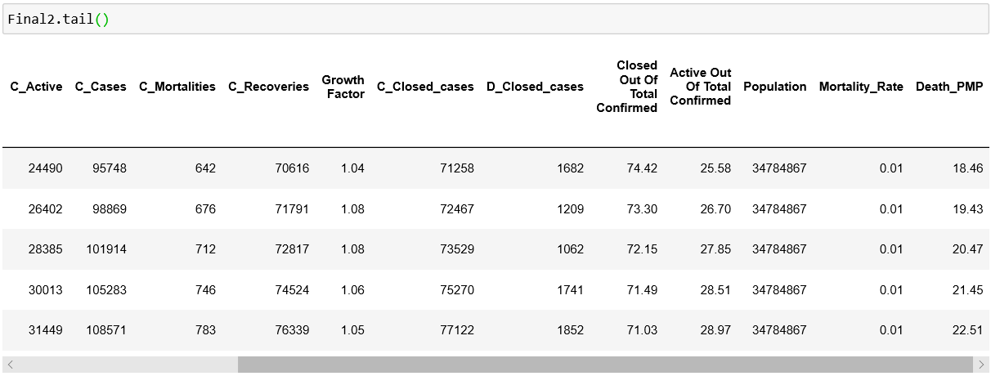
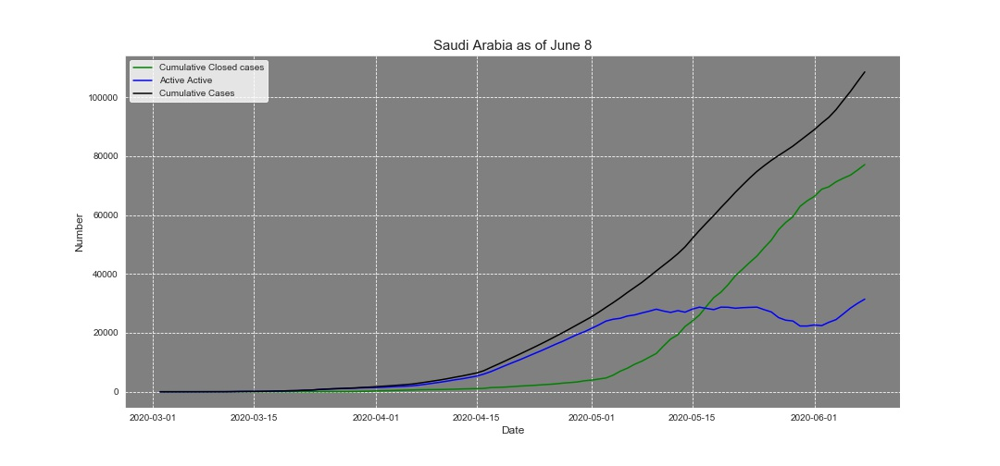
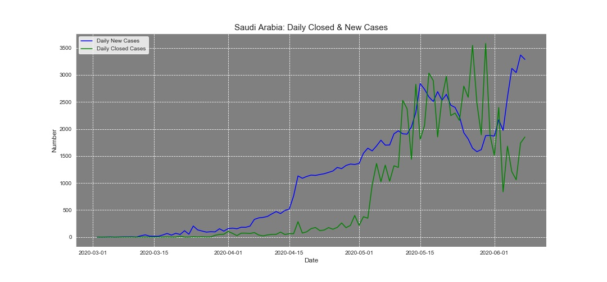

## The Covid19's Situation in the Kingdom of Saudi Arabia. Facts and Insights.  
  
I have been working almost everyday in analyzing Covid19 datasets. I first statred with several countries I was interestd in seeing their situations, but then I kind of came to the realization that inside each country there are a lot of different cities and regions, so analyzing the whole country would not bring much of insghts. Therefore, I decided to look for other datasets which have detailed info by cities. Finally, I came acroos a detailed dataset. This dataset is usually updated daily and contains all numbers of Covid19 cases, mortalities, recoveries, and active cases by cities. It does povide other info, but I have not looked into them yet.  

So, in this personal project I am going to walk you through the process of handling this dataset & what insights it can offer. I mainly use data visualization tools to show the numbers and percentages. These visuals will also answer some questions which will lead to other questions. While this project presents the numbers and percentages for the whole country, another project will be added with further detailed analyses for major citites. 

#### Reminder: This project aims at providing insights & facts as well as serving as a tutorial. I will be updating it when there is a change in the trends.   

##### Okay, let's dive in.  
**importing the needed packages**  

```
import numpy as np  
import pandas as pd  
import matplotlib.pyplot as plt  
import seaborn as sns  
```
**Using pandas, read the csv file.**
```
df = pd.read_csv("path/for/your/file.csv")  
df.head()
```  
The dataset looks like this:  

  

**Little info about the data.**  
The reason of doing this porocessing is that the dataset is mainly divided into two categories which are *Cumulative* and *Daily*.  
For each category, there are at least three sub-categories. Cumulative category contains four sub-categories which are Cases, Recoveries, Mortalities & Active cases, while Daily category contains three sub-categories which are Cases, Recoveries & Mortalities.  
There are over 150 columns in the dataset. However, there is an interesting column named Event. This columns shows the measures have been taken so far by the Saudi governemnt in their fight against Covid19. 
Further, the other columns represent cities & their numbers for categories and sub-categories along with the dates.

**Next, we need to do some processings.**  
First, we need to split the two main categories. The indexing is required because we need the dates in the in the process of reshaping.
##### Splitting Cumulative and Daily Numbers & Index Them.  

```
Cumulative = (df[df["Daily / Cumulative"]=="Cumulative"])
Cumulative = Cumulative.set_index("Date")
Daily = (df[df["Daily / Cumulative"]=="Daily"])
Daily = Daily.set_index("Date")
```
##### Splitting Cumulative  
```
#'Cases', 'Recoveries', 'Mortalities', 'Active cases'
C_Active = (Cumulative[Cumulative["Indicator"]=="Active cases"])
C_Active = C_Active.iloc[:,4:]

C_Cases = (Cumulative[Cumulative["Indicator"]=="Cases"])
C_Cases = C_Cases.iloc[:,4:]

C_Recoveries = (Cumulative[Cumulative["Indicator"]=="Recoveries"])
C_Recoveries = C_Recoveries.iloc[:,4:]

C_Mortalities = (Cumulative[Cumulative["Indicator"]=="Mortalities"])
C_Mortalities = C_Mortalities.iloc[:,4:]
```
##### Splitting Daily  

```
#'Cases', 'Recoveries', 'Mortalities'

D_Cases = (Daily[Daily["Indicator"]=="Cases"])
D_Cases = D_Cases.iloc[:,4:]

D_Recoveries = (Daily[Daily["Indicator"]=="Recoveries"])
D_Recoveries = D_Recoveries.iloc[:,4:]

D_Mortalities = (Daily[Daily["Indicator"]=="Mortalities"])
D_Mortalities = D_Mortalities.iloc[:,4:]

```
In this code for example `D_Mortalities = D_Mortalities.iloc[:,4:]`, we are selecting all rows `:` from the fifth columns to the end `4:`.  
After splitting the those sup-categories, we need to reshape them and then join all these dataframes into one sngle dataframe.
I used the below codes to reshape the dataframes and join them into one dataframe. The reason is that I need the columns to be representative of the sub-categories and rows representative of the dates.    
**Reshaping the dataframes**
```
#'Cases', 'Recoveries', 'Mortalities', 'Active cases'
C_Active = pd.DataFrame(C_Active.stack())
C_Active["C_Active"] = C_Active[0]
C_Active = C_Active.drop(columns=[0])
C_Active.index.names = ["Date","City"]

C_Cases =pd.DataFrame(C_Cases.stack())
C_Cases["C_Cases"] = C_Cases[0]
C_Cases = C_Cases.drop(columns=[0])
C_Cases.index.names = ["Date","City"]

C_Recoveries = pd.DataFrame(C_Recoveries.stack())
C_Recoveries["C_Recoveries"] = C_Recoveries[0]
C_Recoveries = C_Recoveries.drop(columns=[0])
C_Recoveries.index.names = ["Date","City"]

C_Mortalities = pd.DataFrame(C_Mortalities.stack())
C_Mortalities["C_Mortalities"] = C_Mortalities[0]
C_Mortalities.index.names = ["Date","City"]
C_Mortalities = C_Mortalities.drop(columns=[0])


#'Cases', 'Recoveries', 'Mortalities'
D_Cases =pd.DataFrame(D_Cases.stack())
D_Cases["D_Cases"] = D_Cases[0]
D_Cases = D_Cases.drop(columns=[0])
D_Cases.index.names = ["Date","City"]


D_Recoveries = pd.DataFrame(D_Recoveries.stack())
D_Recoveries["D_Recoveries"] = D_Recoveries[0]
D_Recoveries = D_Recoveries.drop(columns=[0])
D_Recoveries.index.names = ["Date","City"]


D_Mortalities = pd.DataFrame(D_Mortalities.stack())
D_Mortalities["D_Mortalities"] = D_Mortalities[0]
D_Mortalities = D_Mortalities.drop(columns=[0])
D_Mortalities.index.names = ["Date","City"]
```
When we stacked the dataframes, we added another index which contains the cities' names. The second line of code basically renames the column number. The third line drops the the column which was automatically created baceuse of the stacking and named 0. The fourth line renames the indexes. Then, the process is repeated for each new category.  
Next, we finally join the dataframes into our final one. However, this datframes contains data for each day by city.  
  

 However, this datframes contains data for each day by city. To make it represent the whole country, we need to one final step. We will need to sum all rows by dates. To do that, I will execute the below codes.
```
Final = Final.reset_index()
Final["Date"] = pd.to_datetime(Final["Date"])
Final2 = Final.set_index("Date")
Final2 = Final2.sum(level=0)
```
The first line of code obviously resets the indexes. The second converts the date column into datetime datatype. Then, we set again the date column as an index to calculate the sum of each day for each column and remove the city column.  
Our final should look like this.  

   

**Next step is creating further columns needed in the analysis.**  

First column to create is called *growth factor -for Active Cases-*. The growth factor is calculated as follow; I simply divide the total number of active cases by the total number of active cases in the previous day. The reason for doing this calculation is that most countries fear to get to the point where their healthcare systems cannot handle the amount of infected people in the country. Therefore, this calculation can give an estimate or a picture of by how far the cases are growing. The growth factor can be very helpful in arrnging and distributing resources across regions and cities to achieve efficiency & effectiveness.  
When the number is below 1, it means active cases are decreasing, and when it is above one, it means it is increasing. This variable can be eaasily misinterpreted due to it complexity.  

For example, if there were 150,000 active cases yesterday, and today had 175,000 active cases, and the next had 200,000 active cases, that means there were 1.17 increase in the second day (by 25,000 cases) and 1.14 in the third day relative to the previous day. While the the growth factors show a slight increase, the cases actually grew by 50,000 in just two days. Further, the grow factor itself does not hold any meaning, but it must be provided with some context of the total number of active cases.  
The next two columns are going to be the total number of cumulative mortalities and recoveries (cumulative closed cases) & total number of daily mortalities and recoveries (daily closed cases). After that, we wll create two further two columns to measure the proportions of closed cases & active cases out of total number of confirmed cases.  

Additionally, we will calculate the mortality rate for Covid19 over time as well as its death rate per a million population. To do so, we will need to find the total number of the population in Saudi Arabia for 2020. According to Worldometers, the population is estimated to be slightly over 34 million.  
The mortality rate, on the other hand, for an ifectious disease is arguably difficult to calculate spicially during an ongoing epidemic. Anyway, there are different ways to calculate it, but the one I personally lean towars to is dividing the total number of deaths by the total number of closed cases, the cases which have an outcome. I am borrowing this method from the Wordlometers which I believe it makes more sense than other methods. 

#### I used those lines of codes to do so.  
```
Final2["Growth Factor"] = round(Final2["C_Active"] / Final2["C_Active"].shift(1),2)
Final2["C_Closed_cases"] = Final2["C_Recoveries"] + Final2["C_Mortalities"]
Final2["D_Closed_cases"] = Final2["D_Recoveries"] + Final2["D_Mortalities"]
Final2["Closed Out Of Total Confirmed"] = round(Final2["C_Closed_cases"] / Final2["C_Cases"]*100,2) 
Final2["Active Out Of Total Confirmed"] = round(Final2["C_Active"] / Final2["C_Cases"]*100,2)
Final2["Population"] = 34784867 # According to Worldometers
Final2["Mortality_Rate"] = round(Final2["C_Mortalities"] / Final2["C_Closed_cases"],2)
Final2["Death_PMP"] = round(Final2["C_Mortalities"] / Final2["Population"]* 1000000,2)
```
Here is the look of our final dataframe:  

   

#### Data Visualization:  

Now, we have our final dataframe ready for some analyses. First thing I want to see is the comparison between total number of cumulative confirmed cases, the total number of cumulative closed cases & the total number of active cases over time. Therefore, the best chart to visualize the changes over time is line chart.  

   
 
 By looking at the chart, we observe that the total number of closed cases are significantly higher than the total number of active cases. In fact, it is closer to the total number of cumulative confirmed cases to the total number of active cases. While that is a good sign of handling the panademic very well, the increase in the total number of active cases is concerning due to several reasons. Largely, the more active cases the more hospital beds, medical staff, & other resources are needed. Further, this increase means there is a higher possibility of higher infection rates. We also observe that the total number of active cases reached a peak on early May and plateaued for roughly ten days. After that period, the number of dropped from roughly 28 thousands to 22 thousands which is mainly due to the increase in total number of closed cases. On the other hand, that decrease did not last for long time, and in fact it has been increasing since then. Additionally, it is expected to increase gradually for the next few days. There is a conclusion I would like to draw here. I believe the goal of completely stopping the spread of Covid19 is not realistic nor attainable at this time. However, the goal should be slowing the spread rate through issuing regulations and recommendations to raise awareness about the seriouness of this virus, since there has not been any vaccine or a cure yet.  
 
 *The code used to generate the graph:*  
 ```
plt.figure(figsize=(15,7))
ax = sns.lineplot(Final2.index,"C_Closed_cases",data=Final2,color="green",label="Cumulative Closed cases")
ax = sns.lineplot(Final2.index,"C_Active",data=Final2,color="blue",label="Active Active")
ax = sns.lineplot(Final2.index,"C_Cases",data=Final2,color="black",label="Cumulative Cases")
ax.set_facecolor("gray")
plt.xlabel('Date',size=12)
plt.ylabel('Number',size=12)
plt.xticks(size=10)
plt.yticks(size=10)
plt.title("Saudi Arabia as of June 8",size=15)
legend = plt.legend(frameon = 1)
frame = legend.get_frame()
frame.set_color('white')
plt.savefig(path/for/the/saved/graph)
plt.show()
 ```
 
After looking at the actual numbers of active and closed cases compared to the cumulative confirmed cases, we are going to explore the percentages of those two numbers relative to cumulative confirmed cases. The below grpah shows that.  

   
 
 The the percentages of active cases out of total cumulative confirmed cases were fluctuating with a slightly dropping trend till early April. On March 30th, the King ordered issued a decree to provide free treatment for Covid19 to all illigal residents besides citizens and legal residents. This decrease might be attributed to two possibile factors.  
It is known that the symptoms of Covid19 might take up to 14 days to appear, so there could have been some infected patients without showing any symptoms. Besides, there were a lot of illigal residents who were anxious about seeking testing and treatment. Therefore, early April the percentages of active cases out of total cumulative confirmed cases rose and plateaued till roughly May 2nd when dramatically dropped by approximately 50%. Since June 2nd, the percentage of active cases has been increasing due to the lower daily number of closed cases compared to the daily number of new cases.  

The code used to generate the second graph is similar to the previous one with different parameters 
 
 **Active Cases' Growth Factor**  
 
 *The below chart shows by how much there is an increase or decrease in the number of active cases over time.*  
 
    
  
  
 **Daily New Cases vs Daily Closed Cases**
 
 Our final step is to visulaize the daily new cases and daily closed cases over time. The reason for this is to explain the and show the pattern of the total number of active cases. The below chart shows the lag between new cases and closed cases. Roughly, it takes two weeks for the closed cases to have similar pattern as the daily new cases. 
 
    

 #### *Final point*  
 
There are lot of an unanswered questions I am planning to address in a different project. In the next project, I will be assessing the situation for different cities in the kingdom, mainly because there are some cities have been hit harder than others. Furtheremore, I would like to look into the cities with highest numbers in all categories and draw some comparisons. 

 *The dataset can be accessed throught this portal*  
 https://datasource.kapsarc.org/explore/dataset/saudi-arabia-coronavirus-disease-covid-19-situation/information/?disjunctive.daily_cumulative&disjunctive.indicator&disjunctive.event&disjunctive.region&disjunctive.city  
 
 
 Thanks for reading it! 
 
 By: Salman Aljoudi  
 salman.aljoudi@gmail.com
 
 *Notes:* **the codes will be added ASAP** 
